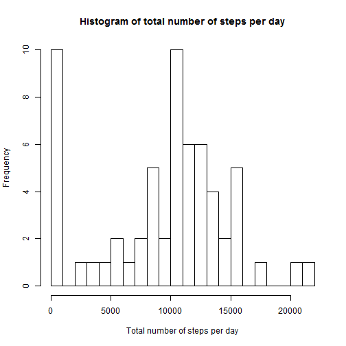
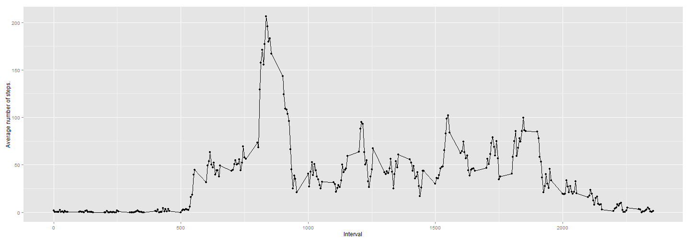
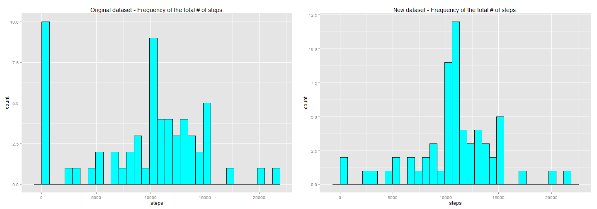
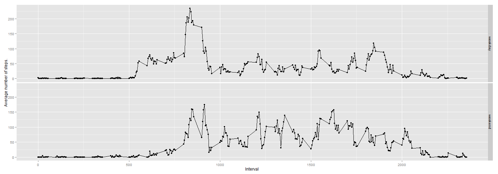

## Loading and preprocessing the data

Extracting the the zip file into the data folder.

```r
library(stats)
library(ggplot2)
library(grid)
library(gridExtra)

if(!file.exists("data"))
{
        dir.create("data") 
}

destPath = "activity.zip"
csvPath = ".\\data\\activity.csv"
if(!file.exists(csvPath))
{
        unzip(destPath, exdir = "data")     
}
```

Read the csv file

```r
#Read the csv file.
data <- read.csv(csvPath)
```

Preprocess the date and interval fields

```r
data$date <- as.Date(data$date)
data$interval <- sprintf("%04d", data$interval)
```

## What is mean total number of steps taken per day?

Calculate the total number of steps taken each day and plot the values for each day.


```r
totalStepsPerDay <- aggregate(data$steps, list(data$date), sum, na.rm=TRUE)
names(totalStepsPerDay) <- c("date", "steps")
```

Plot the histogram that is expected by the assigment. This graph shows the frequency of the total number of steps.


```r
hist1 <- hist(totalStepsPerDay$steps, breaks=30, xlab="Total number of steps per day", main = "Histogram of total number of steps per day")
```

 

```r
plot <- ggplot(totalStepsPerDay, aes(x=steps))
plot <- plot + geom_histogram(colour="black", fill="cyan")
plot <- plot + labs(title = "Original dataset - Frequency of the total # of steps.")
```

Calculate the mean and the median number of steps for each day

```r
mean <- mean(totalStepsPerDay$steps);mean
```

```
## [1] 9354
```

```r
median <- median(totalStepsPerDay$steps);median
```

```
## [1] 10395
```

The mean number of steps is 9354.2295.
The median number of steps is 10395.

## What is the average daily activity pattern?


```r
meanStepsPerInterval <- aggregate(data$steps, list(data$interval), mean, na.rm=TRUE)
#Set the NaN values to 0
names(meanStepsPerInterval) <- c("interval", "steps")
```


Plot that shows the average number of steps during a day

```r
p <- qplot(as.integer(interval), steps, data = meanStepsPerInterval)
p + geom_line() + xlab("Interval") + ylab("Average number of steps.")
```

 


```r
maxSteps <- max(meanStepsPerInterval$steps, na.rm = TRUE)
maxSteps
```

```
## [1] 206.2
```

```r
maxInterval <- meanStepsPerInterval[which(meanStepsPerInterval$steps == maxSteps),]$interval
maxInterval
```

```
## [1] "0835"
```

The time of the day with the highest number of steps on average is 0835

## Imputing missing values


```r
numberOfNAs <- sum(is.na(data$steps))
numberOfNAs
```

```
## [1] 2304
```

There are 2304 NA values is the dataset.


Calculate 


```r
newData <- data
meanStepsPerDay <- aggregate(newData$steps, list(newData$date), mean, na.rm=TRUE)
names(meanStepsPerDay) <- c("date", "steps")
meanStepsPerInterval <- aggregate(newData$steps, list(newData$interval), mean, na.rm=TRUE)
names(meanStepsPerInterval) <- c("interval", "steps")
```

For days were all intervals are NA, we are going to set the value of each interval to the average value of that interval over all the days.


```r
daysWithAllNaIntervals <- meanStepsPerDay[is.na(meanStepsPerDay$steps),"date"]
for(date in daysWithAllNaIntervals) {
       newData[newData$date == date,]$steps <- meanStepsPerInterval$steps 
}
```


```r
numNaValues <- sum(is.na(newData$steps))
numNaValues
```

```
## [1] 0
```

The number of NA values is the data set is 0.

Calculate the mean and the median number of steps for each day using the new data set

```r
newTotalStepsPerDay <- aggregate(newData$steps, list(newData$date), sum, na.rm=FALSE)
names(newTotalStepsPerDay) <- c("date", "steps")

newMean <- mean(newTotalStepsPerDay$steps)
newMean
```

```
## [1] 10766
```

```r
newMedian <- median(newTotalStepsPerDay$steps)
newMedian
```

```
## [1] 10766
```

The mean number of steps is 1.0766 &times; 10<sup>4</sup>.
The median number of steps is 1.0766 &times; 10<sup>4</sup>.

Creating the new histogram

```r
plot2 <- ggplot(newTotalStepsPerDay, aes(x=steps))
plot2 <- plot2 + geom_histogram(colour="black", fill="cyan");
plot2 <- plot2 + labs(title = "New dataset - Frequency of the total # of steps.")
```

Here is a side by side comparison of the histograms showing the frequency of the total number of steps for the original data set and the data set with the NA values filled in.

```r
grid.arrange(plot, plot2, ncol=2)
```

```
## stat_bin: binwidth defaulted to range/30. Use 'binwidth = x' to adjust this.
## stat_bin: binwidth defaulted to range/30. Use 'binwidth = x' to adjust this.
```

 

As you can see from the above histograms, the frequency at the lower end of the number of steps (steps=0) has been reduce a lot with the new dataset.

## Are there differences in activity patterns between weekdays and weekends?

Add a column to the dataset to specify if the day is a weekday or weekend

```r
data$wkday <- ifelse(format(data$date, "%u") %in% c(6,7), 'weekend', 'weekday')

meanStepsPerIntervalWeekday <- aggregate(data$steps, list(data$interval,data$wkday), mean, na.rm=TRUE)
names(meanStepsPerIntervalWeekday) <- c("interval", "weekday", "mean")
```


Plot the average number of steps during the day. Comparison between weekdays and weekend.

We can see that during the week, there are a lot more steps in the morning. The maximum number of steps occurs during the week as well.
During the weekend, there more steps during the day between 10 am and 6 pm.


```r
#qplot(interval, mean, data = meanStepsPerIntervalWeekday, facets = weekday ~ .)

p <- qplot(as.numeric(interval), mean, data = meanStepsPerIntervalWeekday, facets = weekday ~ ., geom = c("point", "line"))
p + xlab("Interval") + ylab("Average number of steps.")
```

 

